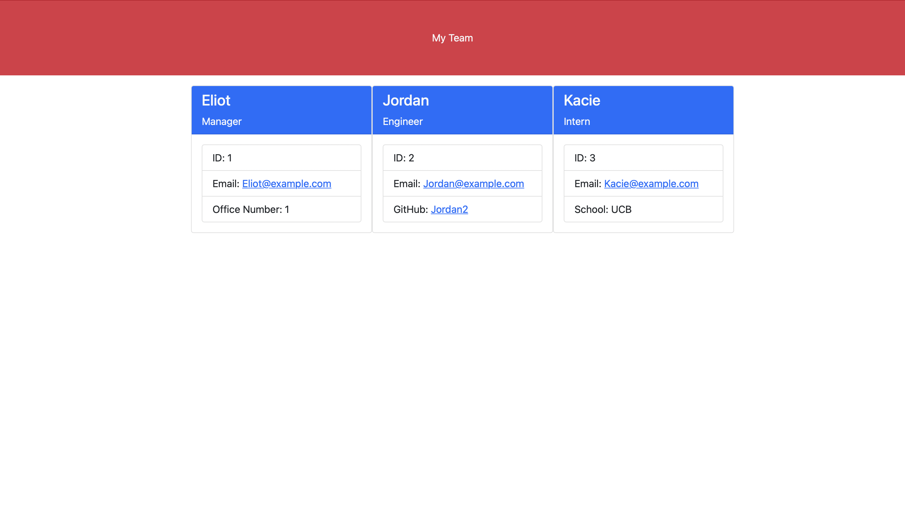

# Team Profile

## Description

'Team Profile' is a Node.js app that creats a webpage to view details about your team just by entering information into the app.

## Installation

to install this project, You just need to clone this repository from GitHub and install the inquirer package to the project

## Usage

To Use, You just need to run 'node index' from the root directory in the command line, and answwer the questions

## Contributions

This project uses the Inquirer package for Node.js, and uses the Jest Package for testing.

## Tests 

Using Jest, I did include a few tests for verifying the employee objects were created correctly

## License

MIT License

Copyright (c) 2021 - Kristian Mitchell

Permission is hereby granted, free of charge, to any person obtaining a copy
of this software and associated documentation files (the "Software"), to deal
in the Software without restriction, including without limitation the rights
to use, copy, modify, merge, publish, distribute, sublicense, and/or sell
copies of the Software, and to permit persons to whom the Software is
furnished to do so, subject to the following conditions:

The above copyright notice and this permission notice shall be included in all
copies or substantial portions of the Software.

THE SOFTWARE IS PROVIDED "AS IS", WITHOUT WARRANTY OF ANY KIND, EXPRESS OR
IMPLIED, INCLUDING BUT NOT LIMITED TO THE WARRANTIES OF MERCHANTABILITY,
FITNESS FOR A PARTICULAR PURPOSE AND NONINFRINGEMENT. IN NO EVENT SHALL THE
AUTHORS OR COPYRIGHT HOLDERS BE LIABLE FOR ANY CLAIM, DAMAGES OR OTHER
LIABILITY, WHETHER IN AN ACTION OF CONTRACT, TORT OR OTHERWISE, ARISING FROM,
OUT OF OR IN CONNECTION WITH THE SOFTWARE OR THE USE OR OTHER DEALINGS IN THE
SOFTWARE.

## Questions
 
[GitHub](https://github.com/Kristian821/)

Email Me at Kristian821@icloud.com
